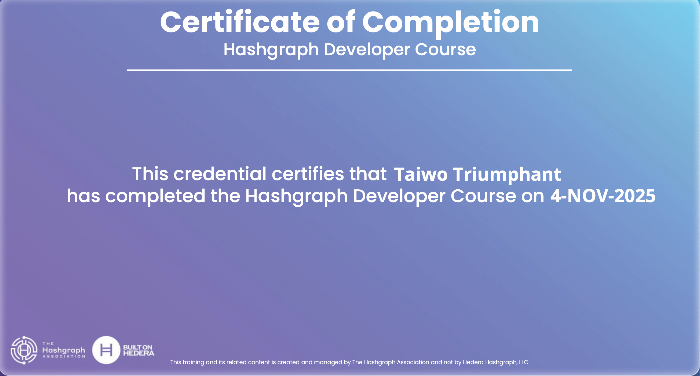

# 🎨 Imagine - Metaverse IpNft Gallery

> **Immersive 3D metaverse experience for IpNft discovery, minting, buying, selling, and live auctions — built on Hedera Hashgraph for transparency and trust.**

## 🌟 Live Demo & Certification

**🚀 [Try Live Demo](https://www.canva.com/design/DAGWxyz123/demo-link-placeholder)**

  
  
<em>Certified on Hedera Hashgraph Network</em>

---

## 📌 Overview

**Imagine** is a evolutionary metaverse platform where **artists, collectors, and enthusiasts** come together in a **fully immersive virtual space** to create, discover, and trade **Intellectual Property NFTs (IpNfts)**.  

Visitors can walk through a **customizable 3D gallery**, interact with digital artworks, **mint new IpNfts, purchase, license, or bid** on items in real time — all backed by **secure Hedera Hashgraph blockchain transactions**.

This project leverages **Hedera's native smart contract capabilities** with **MetaMask integration** for seamless wallet management and on-chain interactions.

---

## 🚀 Core Features

### 🖼 Immersive 3D Art Gallery
- Explore exhibitions in an interactive, metaverse-style environment built with **Three.js**.
- Multiple gallery layouts and ambient lighting for realistic presentation.

### 👤 Customizable Avatars
- Artists and visitors can create personalized avatars to represent themselves in the space.
- Supports unique outfits, accessories, and animations.

### 🎨 Mint & Upload IpNfts
- Create and mint new Intellectual Property NFTs directly in the gallery.
- Upload artwork with custom positioning and rotation controls.
- IPFS-based metadata storage for decentralized content.

### 💰 Buy, Sell, & Auction
- Direct IpNft purchases via Hedera smart contracts.
- Timed auctions with transparent bidding history.
- Blockchain-based proof of ownership and provenance.

### 🔑 Licensing with Smart Contracts
- Artists can license works (art, music, writing) with **clear, immutable terms**.
- Automated revenue distribution through Hedera smart contracts.

### ⚡ Built with Hedera Integration
- **Wallet Connection**: MetaMask with native Hedera support.
- **Smart Contract Execution**: Direct Hedera contract calls for all IpNft operations.
- **Transaction Confirmation**: Streamlined user experience with real-time feedback.

### 🌍 Cross-Platform
- Works in browsers without downloads.
- Compatible with desktop & VR.

---

## 🛠 Tech Stack

| Layer        | Technology |
|--------------|------------|
| **Frontend** | React, Three.js, TailwindCSS, TypeScript |
| **Web3**     | Hedera SDK, MetaMask Integration |
| **Blockchain** | Hedera Hashgraph (Testnet) |
| **Contracts** | Solidity (Hedera Smart Contracts) |
| **Backend**  | Node.js, Socket.io, Hedera SDK |
| **Storage**  | IPFS (Pinata) |

---

## 🌐 Deployment

**Contract ID**: `0.0.7173071` on Hedera Testnet

The IpNft Gallery smart contract is deployed on Hedera Hashgraph, providing:
- ⚡ **Fast transactions** with low fees
- 🔒 **Enterprise-grade security** 
- 🌱 **Carbon-negative network**
- 🔄 **Native smart contract support**

---

## ⚡ Hedera Integration

**Imagine** leverages Hedera's powerful capabilities through:

### 🔗 Wallet Connection
- MetaMask with native Hedera support
- Seamless account management and transaction signing
- Support for both ECDSA and ED25519 key types

### 📝 Smart Contract Operations
- **Mint IpNfts**: `uploadArt()` function for creating new tokens
- **Buy/Sell**: Direct marketplace transactions
- **Auctions**: Transparent bidding with automated settlement  
- **Positioning**: Custom coordinate and rotation settings
- **Licensing**: Immutable licensing terms and revenue distribution

### 🚀 Real-time Features
- Live gallery updates via Hedera contract queries
- Instant transaction confirmations
- Cross-platform synchronization

---

## 🚀 Getting Started

1. **Connect Wallet**: Use MetaMask with Hedera testnet configuration
2. **Explore Gallery**: Walk through the 3D space and discover IpNfts
3. **Mint IpNfts**: Upload your artwork and create new tokens
4. **Trade & Auction**: Buy, sell, and bid on digital assets
5. **Customize**: Position your IpNfts and personalize your avatar

